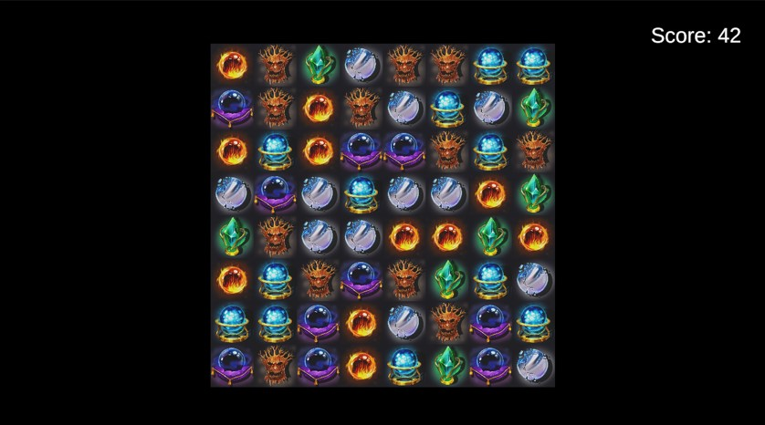

# MiniPang - Match-3 Game Project

## 프로젝트 개요

MiniPang은 클래식한 매치3 게임을 구현한 Unity 프로젝트입니다. 플레이어는 동일한 종류의 타일을 가로 또는 세로로 3개 이상 맞추면 타일이 제거되고, 점수를 얻을 수 있습니다. 이 프로젝트는 다양한 클래스들이 서로 상호작용하여 보드 상태를 관리하고, 매칭을 확인하고, 점수를 계산하며, 게임의 흐름을 제어합니다.

## 주요 기능

- **타일 스왑**: 플레이어는 보드에서 인접한 두 타일을 선택하여 위치를 교환할 수 있습니다.
- **매칭 확인**: 스왑 후 가로 또는 세로로 3개 이상의 동일한 타일이 연결되면 타일이 파괴됩니다.
- **점수 계산**: 매칭된 타일의 수에 따라 점수가 계산되며, 파괴된 타일의 수에 비례하여 점수가 증가합니다.
- **보드 업데이트**: 타일이 파괴된 후 빈 공간이 생기면 타일이 자동으로 채워집니다.
- **가능한 스왑 검사**: 더 이상 스왑할 수 있는 타일이 없을 경우, 보드가 자동으로 셔플됩니다.

## 클래스 구조

### 1. MiniPangBoardManager

- **보드 관리**: 보드의 상태를 관리하며, 초기화, 타일 배치, 보드 업데이트 등을 담당합니다. 또한, 다른 클래스들과 상호작용하여 게임의 흐름을 조정합니다.

### 2. MiniPangTileSwapper

- **타일 스왑**: 두 타일의 위치를 교환하고, 스왑 후 발생하는 매칭을 확인합니다. 매칭이 이루어지면 타일을 파괴하도록 `MiniPangTileDestroyer`를 호출합니다.

### 3. MiniPangMatchChecker

- **매칭 검사**: 특정 타일 또는 보드 전체의 가로 및 세로 매칭을 확인합니다. 매칭된 타일을 찾아내고 이를 제거하도록 `MiniPangTileDestroyer`에 요청합니다.

### 4. MiniPangTileDestroyer

- **타일 파괴**: 매칭된 타일을 파괴하고, 파괴된 타일의 수를 기반으로 점수를 계산합니다. 보드를 업데이트하여 새로운 타일로 빈 공간을 채웁니다.

### 5. MiniPangScoreUpdater

- **점수 관리**: 매칭된 타일 수에 따라 점수를 계산하고, 이를 UI에 반영합니다. 점수 계산과 누적을 담당하며, 현재 점수를 게임 화면에 표시합니다.

### 6. MiniPangTileChecker

- **가능한 스왑 검사**: 보드에서 가능한 스왑이 있는지 확인하고, 게임이 진행 가능한 상태인지 평가합니다. 가능한 스왑이 없을 경우 보드를 셔플합니다.

### 7. MiniPangTileInputHandler

- **사용자 입력 처리**: 플레이어의 입력을 처리하여 타일을 선택하고 스왑합니다. 선택된 타일이 스왑될 수 있는지 검사하고, 스왑 결과를 관리합니다.

### 8. MiniPangBoardInitializer

- **보드 초기화**: 게임 시작 시 보드를 초기화하고, 초기 타일을 배치합니다.

### 9. MiniPangTilePlacer

- **타일 배치**: 보드에 타일을 배치하거나, 파괴된 타일을 채웁니다. 빈 공간이 생길 경우 이를 새로운 타일로 채웁니다.

### 10. MiniPangMatchUtility

- **매칭 유틸리티**: 가로 및 세로 매칭을 확인하는 유틸리티 메서드를 제공합니다. 이 유틸리티를 통해 중복된 코드를 제거하고, 매칭 로직을 일관되게 관리합니다.

## 설치 및 실행 방법

1. Unity Hub를 통해 프로젝트를 클론하거나 로컬로 다운로드합니다.
2. Unity에서 프로젝트를 열고, `MainScene`을 실행합니다.
3. 게임을 플레이하여 타일을 스왑하고, 점수를 획득하세요.

## 게임 플레이 방법

1. **타일 선택**: 마우스를 사용하여 보드에서 타일을 클릭하여 선택합니다.
2. **타일 스왑**: 인접한 두 타일을 클릭하여 스왑합니다. 타일은 가로 또는 세로 방향으로 한 칸씩만 교환할 수 있습니다.
3. **매칭**: 스왑된 타일이 가로 또는 세로로 3개 이상의 동일한 타일과 연결되면 타일이 사라집니다.
4. **점수 획득**: 타일이 사라지면 점수를 얻습니다. 매칭된 타일이 많을수록 더 높은 점수를 획득합니다.
5. **보드 업데이트**: 타일이 사라진 후 빈 공간이 자동으로 채워집니다. 빈 공간이 채워진 후 새로운 매칭이 발생할 수 있습니다.
6. **게임 지속**: 가능한 매칭이 없어질 때까지 게임은 계속됩니다. 매칭이 불가능한 경우 보드가 자동으로 셔플되어 새로운 매칭 가능성을 제공합니다.
