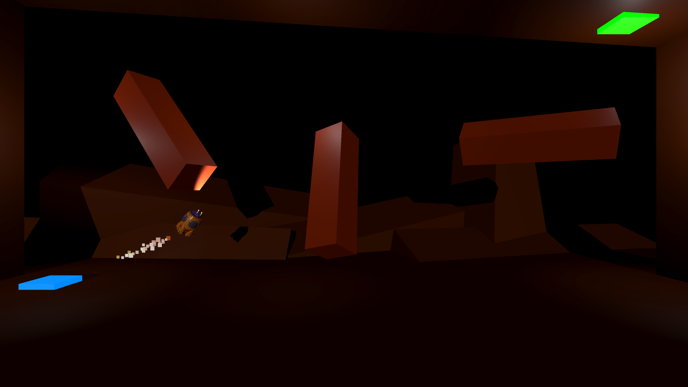
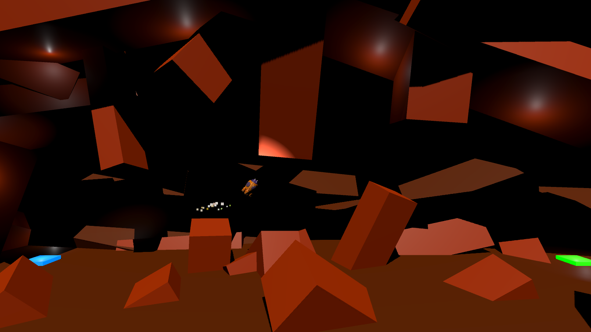

# 🚀 RocketBoost

**RocketBoost**는 플레이어가 우주선을 조종하여 장애물을 피하고 목표 지점에 도달하는 스릴 넘치는 게임입니다. 레벨마다 점점 더 복잡한 장애물이 등장하며, 도전과 재미를 동시에 제공합니다!

---

## 🎮 주요 기능

- **우주선 조종**: 메인 추력 및 회전을 이용해 정밀하게 우주선을 조작하세요.
- **장애물 회피**: 움직이거나 회전하는 장애물을 피하며 생존하세요.
- **다양한 레벨**: 각기 다른 난이도의 레벨로 구성된 다양한 맵.
- **충돌 효과**: 충돌 시 파티클 효과 및 사운드 연출로 생동감 극대화.
- **플랫폼 지원**: Android 및 PC에서 원활히 실행 가능.

---

## 📂 프로젝트 구조

### 주요 스크립트

1. **Oscillator** (`Oscillator.cs`)

   - 장애물의 움직임과 회전을 구현.
   - `movementVector`와 `rotateSpeed`로 동작을 조정 가능.

2. **PlatformManager** (`PlatformManager.cs`)

   - Android 플랫폼에서 특정 오브젝트 활성화 관리.
   - 플랫폼별로 다른 오브젝트 동작 제어.

3. **CollisionHandler** (`CollisionHandler.cs`)

   - 장애물 및 목표 도달 시 충돌 처리를 담당.
   - 충돌 이벤트에 따른 사운드와 파티클 효과 구현.

4. **Movement** (`Movement.cs`)
   - 우주선의 추력 및 회전 로직을 구현.
   - UI 버튼 및 키보드 입력을 통한 조작 지원.

---

## 🔧 설치 및 실행 방법

1. **Unity 프로젝트 열기**  
   Unity 버전 `2022.3.40f1` 이상에서 프로젝트를 열어주세요.

2. **필수 설정**

   - Android 빌드를 위한 플랫폼 설정을 완료하세요.
   - 사운드 및 파티클 효과를 적절히 배치하세요.

3. **실행**
   - Play 버튼을 눌러 에디터에서 테스트하거나, Android 기기로 빌드하여 실행하세요.

---

## 📜 게임 방법

1. 스페이스바 또는 화면 터치를 통해 우주선을 위로 이동.
2. `A` 키 또는 왼쪽 버튼을 눌러 좌회전, `D` 키 또는 오른쪽 버튼으로 우회전.
3. 장애물을 피하고 목표 지점에 안전하게 착륙.
4. 충돌 시 레벨이 초기화되며, 성공 시 다음 레벨로 이동.

---

## 🎨 스크린샷

## 

## 🛠️ 사용된 기술

- **Unity**: 게임 엔진
- **C#**: 스크립팅 언어
- **Particle System**: 효과 구현
- **Audio Source**: 사운드 관리

---

## 📧 문의

더 궁금한 점이 있으면 [ralskwo@gmail.com](mailto:ralskwo@gmail.com)으로 연락해주세요. 😊
